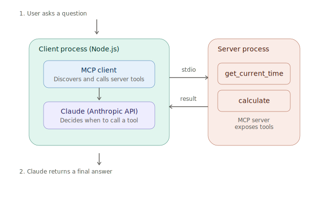

# mcp-client-starter

A minimal TypeScript example of an **MCP (Model Context Protocol) client** that connects to an MCP server and lets Claude call that server's tools as part of a normal conversation.

This was built as a follow-up to the [`claude-api-starter`](https://github.com/Lazaro549/claude-api-starter) repo, applying concepts from Anthropic Academy's MCP course to the client side of the protocol.

## What's in here

- **`src/example-server.ts`** — a tiny MCP server (running over stdio) that exposes two demo tools: `get_current_time` and `calculate`.
- **`src/index.ts`** — the MCP client. It spawns the example server, discovers its tools, converts them into Claude-compatible tool definitions, and runs an agent loop: ask Claude a question → if it wants to call a tool, call it via MCP → feed the result back → repeat until Claude has a final answer.

This mirrors how a real MCP integration works: the server doesn't know anything about Claude, and the client doesn't know anything about how the server's tools are implemented — they only share the protocol.

## Architecture



A user question goes to the client process, where Claude decides whether to call a tool. If it does, the request crosses to the server process over stdio, and the result returns the same way before Claude produces its final answer.

## Setup

```bash
npm install
cp .env.example .env
# then add your ANTHROPIC_API_KEY to .env
```

## Usage

Just run the client — it automatically starts the example server as a subprocess:

```bash
npm run dev
```

You can also pass a custom question:

```bash
npm run dev -- "What's 9 * 9, and what time is it?"
```

Expected flow:
1. Client connects to the MCP server and lists its tools.
2. Claude receives the user's question along with the tool definitions.
3. If Claude decides it needs a tool, the client calls it via MCP and returns the result to Claude.
4. Claude produces a final natural-language answer using the tool output.

## Project structure

```
mcp-client-starter/
├── src/
│   ├── example-server.ts   # MCP server exposing demo tools
│   └── index.ts             # MCP client + Claude agent loop
├── .env.example
├── package.json
├── tsconfig.json
└── README.md
```

## Extending this

- Swap `example-server.ts` for any other MCP server (just change the `command`/`args` in `StdioClientTransport`).
- Add more tools to the example server to see how they automatically show up in Claude's tool list.
- Connect to a remote MCP server over HTTP/SSE instead of stdio by swapping the transport.

## Related

- [claude-api-starter](https://github.com/Lazaro549/claude-api-starter) — streaming, tool use, multi-turn conversations, and a ReAct-style agent loop using the Claude API directly.

## 📜 Certifications

This project was built on top of concepts from Anthropic Academy's MCP coursework:

- [Introduction to Model Context Protocol](./assets/Introduction_to_Model_Context_Protocol.pdf) — Certificate of Completion, Lazaro Gomez Vitolo

## 💸 Donations

If you'd like to support this project:

- 🇦🇷 ARS (Argentina)
  Alias: `lazaro.503.alaba.mp`
- 🌎 USD (Argentina only, local transfers)
  Alias: `ahogada.duras.foca`

## License

MIT
